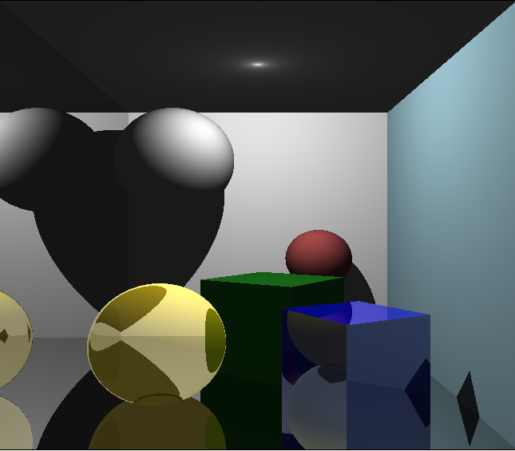

#  Учебный проект: Рейтрейсинг и комната Корнуэлла

Этот проект представляет собой реализацию алгоритма трассировки лучей (Ray Tracing) на C# в среде Windows Forms. В качестве тестовой сцены используется классический тест для рендеринга — **«Корнуэльская комната»** (Cornell Box). Проект позволяет визуализировать трехмерную сцену с кубами и сферами, взаимодействующими со светом, и предоставляет возможность в реальном времени настраивать параметры материалов (отражение, преломление, зеркальность стен) через графический интерфейс.

##  Демонстрация сцены (Результат)

**Скриншот сцены:**

*Пример визуализации «Корнуэльской комнаты». На изображении видны зеркальные и прозрачные объекты, а также настройка освещения.*

##  Возможности

- **Полноценный рендеринг сцены:** построение изображения с использованием алгоритма трассировки лучей.
- **Настройка материалов:**
  - Коэффициент отражения (Reflection) для шара и куба.
  - Коэффициент преломления (Refraction / прозрачность) для шара и куба.
  - Зеркальность (Specular) для каждой из шести стен комнаты (опционально).
- **Управление освещением:** возможность включения второго источника света.
- **Динамическая перестройка сцены:** все изменения применяются после нажатия кнопки `Ray Trace (Рендеринг)`.
- **Современные эффекты:** поддержка отражений, преломлений, диффузного и фонового освещения.

##  Используемые технологии

- **Язык:** C# (.NET Framework / .NET Core)
- **Графический фреймворк:** Windows Forms (`System.Windows.Forms`)
- **Графика:** `System.Drawing` (GDI+) для отрисовки пикселей
- **Математика:** Векторная и матричная арифметика (собственная реализация `Point3D` и операций трансформации)

##  Описание архитектуры

### Основные классы

1.  **`Point3D`**
    - Базовый класс для работы с трехмерными точками и векторами.
    - Реализует основные операции: сложение, вычитание, умножение, скалярное произведение, нормализация.

2.  **`Ray`**
    - Представляет луч (начало + направление).
    - Содержит методы для вычисления отраженного и преломленного луча.

3.  **`Figure`**
    - Абстрактное представление фигуры в сцене.
    - Содержит список вершин (`points`) и граней (`sides`).
    - Реализует алгоритм пересечения луча с треугольниками (для триангуляции) и преобразования (поворот, перемещение, масштабирование).
    - Поддерживает комнату (`isRoom`), что позволяет назначать разные материалы для каждой стены.

4.  **`Sphere` (наследует `Figure`)**
    - Специализированный класс для сферы.
    - Реализует математически точное пересечение луча со сферой.

5.  **`Light`**
    - Источник света. Хранит позицию и цвет.
    - Содержит метод `shade` для расчета локальной модели освещения (диффузная составляющая).

6.  **`Material`**
    - Описание физических свойств поверхности:
      - `reflection`: коэффициент отражения.
      - `refraction`: коэффициент преломления.
      - `ambient`: коэффициент фоновой освещенности.
      - `diffuse`: коэффициент диффузного рассеяния.

7.  **`Form1`**
    - Основной класс UI.
    - Содержит логику построения сцены (`build_scene`), инициализации пикселей, выполнения трассировки (`RayTrace`) и обработки событий (слайдеры, чекбоксы).

### Алгоритм трассировки

1.  Для каждого пикселя экрана генерируется луч из фокуса камеры через соответствующий пиксель виртуального экрана (метод `get_pixels`).
2.  Вызывается рекурсивная функция `RayTrace`, которая:
    - Находит ближайшее пересечение луча с объектами сцены.
    - Вычисляет цвет в точке пересечения, суммируя фоновое освещение (`ambient`).
    - Если точка видна из источника света (проверка `is_visible`), добавляется диффузная составляющая.
    - Если материал имеет коэффициент отражения/преломления, рекурсивно запускает трассировку отраженного/преломленного лучей.
3.  Полученный цвет пикселя ограничивается диапазоном `[0, 1]` и преобразуется в `Color`.

##  Установка и запуск

1.  Клонируйте репозиторий или скачайте архив с исходным кодом.
2.  Откройте файл проекта (`RayTracing.sln`) в **Visual Studio** (версия 2019 или выше).
3.  Убедитесь, что проект настроен на использование `.NET Framework 4.5+` или `.NET 5/6/7` (при необходимости обновите Target Framework).
4.  Нажмите **F5** или кнопку **Start** для сборки и запуска приложения.

##  Как пользоваться

1.  **Запустите приложение.**
2.  **Настройте сцену с помощью элементов управления:**
    - **Коэф. Отражения (Refl):** управляет зеркальностью куба (слева) и шара (справа).
    - **Коэф. Прозрачности (Refr):** управляет прозрачностью куба (слева) и шара (справа).
    - **Зеркальность стен:** отметьте одну или несколько стен, чтобы сделать их зеркальными.
    - **Второй источник:** добавьте дополнительный источник света для улучшения освещения.
3.  Нажмите кнопку **«Ray Trace (Рендеринг)»**.
4.  Дождитесь завершения рендеринга (изображение появится в левой части формы).

##  Структура файлов

| Файл | Описание |
| :--- | :--- |
| `Form1.cs` / `.Designer.cs` | Графический интерфейс, логика построения сцены и рендеринга. |
| `Figure.cs` | Базовый класс фигуры, трансформации, пересечение с лучом. |
| `Sphere.cs` | Класс сферы и специфичная для неё функция пересечения. |
| `Ray.cs` | Класс луча и методы отражения/преломления. |
| `Point3D.cs` | Векторная математика в 3D. |
| `Light.cs` | Источник света и расчет освещения. |
| `Material.cs` | Свойства материалов. |
| `Side.cs` | Класс грани полигональной фигуры. |
| `Program.cs` | Точка входа в приложение. |

